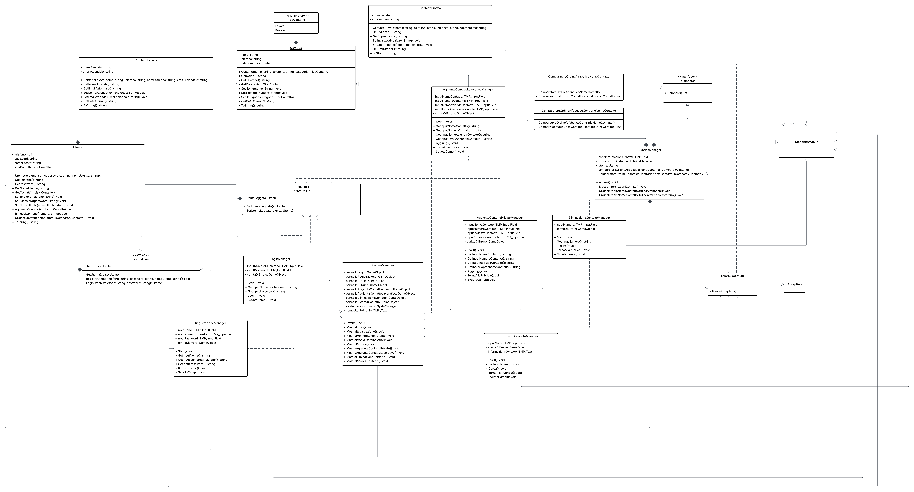

# Progetto vacanze estive MyRubrica
Boubagura Yassin

## Link al progetto GitHub: https://github.com/Y4ss1nB/ProgettoVacanzeMyRubrica

## Descrizione dell'app
Il progetto consiste nella creazione di una rubrica usando Unity. La rubrica si chiama MyRubrica ed ha uno stile minimal ed è molto inuitiva, infatti ha tasti e spazi per l'input ben visibili e chiari ed ha anche colori vivaci. L'utente potrà registare tutti i contatti in questa rurbica che possono essere di due tipi, dato che ci sono i contatti privati e i lavorativi. L'utente per poter accedere alla rurbica dovrà eseguire un login con il numero di telefono e la passoword inseriti in fase registrazione. L'utente se sprovvisto di un account avrà la possibilità di registrarsi inserendo: nome, numero di telefono e una password; una volta completata la registrazione potrà accedere alla sua rurbica. Una volta eseguito il login l'utente accederà alla schermata del suo profilo da cui poi schiacciando l'apposito tatso potrà andare alla schermata dove può vedere la rurbica e modificarla aggiungendo contatti o eliminandoli. Per aggiungere un contatto privato l'utente dovrà inserire: nome, numero di telefono,indirizzo e soprannome; invece per aggiungere un contatto lavorativo l'utente dovra inserire: nome, numero di telefono, email aziendale e nome dell'azienda. Non possono esserci contatti con lo stesso numero o lo stesso nome. Nessun utente può creare un account con un numero già registrato. In Caso l'utente faccia delle cose sbagliate all'interno di MyRubrica appariranno delle scritte rosse che diranno l'errore comesso all'utente ad esempio se prova a registarrsi con un numero già registarto apparira una scritta rossa che dirà che quel numero è già registarto. L'utente può cercare un contatto ricordandosi il nome con il quale lo avava salvato e può anche ordinare la rurbica in ordine alfabetico e in ordine alfabetico al contartio. MyRubrica si adatta a differenti dimensioni dello shermo e i tasti possono essre di tre diverse tonalità di gallo in base a se sono schiacciati o meno e se ci si passa sopra con il mouse o no. 

## Tecnologie usate
- Librerire usate:
    - UnityEngine: usata per parti di codice specifico di unity come ad Esempio MonoBehaviour 
    - TMPro : usata per l'uso dei testi di TextMesh Pro
    - System: usata per funzionalità di base di C#
    - System.Collections.Generic: usata per usare le liste

## UML
 

## Prototipo dell'interfaccia
 

## Screenshot dell'interfaccia finale
### Schermata di login
 
### Schermata di registrazione
 
### Schermata del profilo
 
### Schermata della rurbica 
 
### Schermata per l'aggiunta di un contatto privato
 
### Schermata per l'aggiunta di un contatto lavorativo
 
### Schermata per l'eliminazione di un contatto
 
### Schermata per la ricerca di un contatto
 

